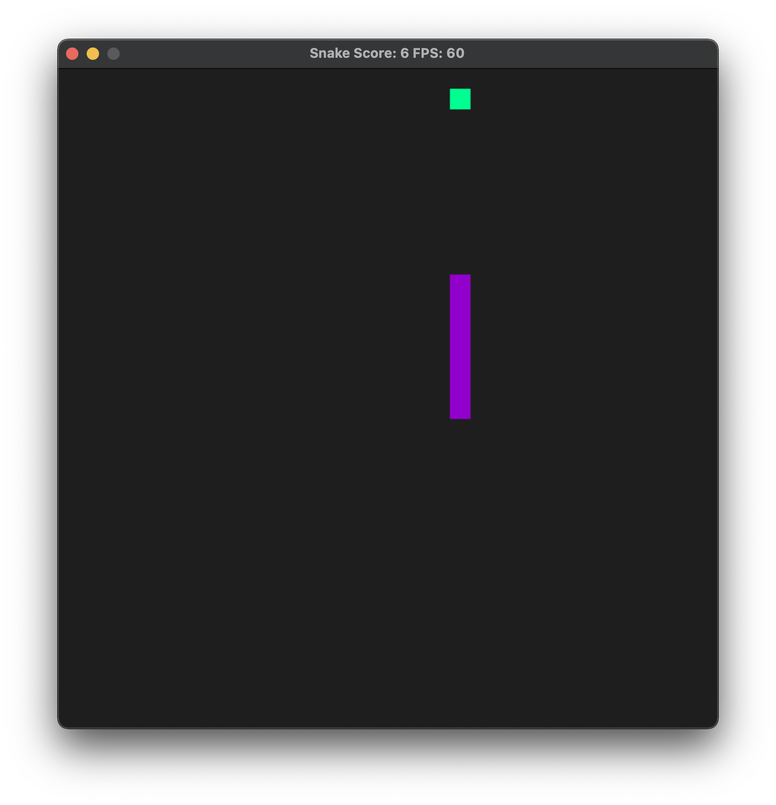
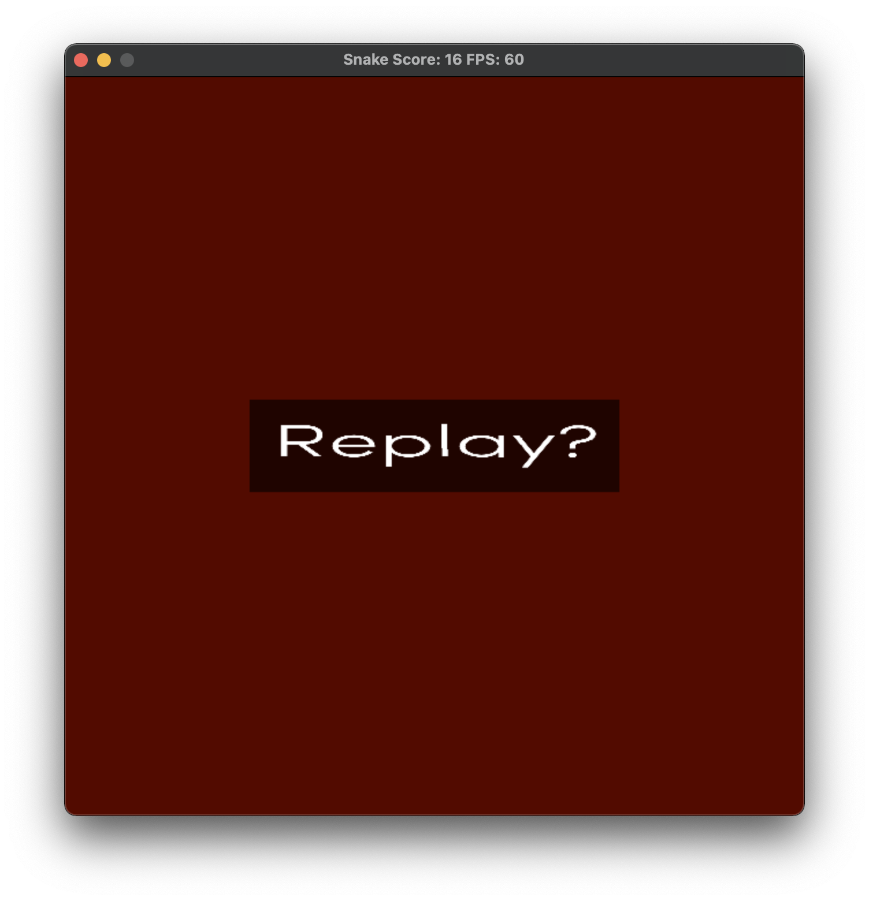

# Cpastone_TBD

[](https://opensource.org/licenses/MIT) [](https://svgshare.com/i/ZjP.svg) [](https://atom.io)

Welcome to my Capstone Project for my [Udacity's C++ Nanodegree](https://www.udacity.com/course/c-plus-plus-nanodegree--nd213)!

For this project, I chose to improve the SDL game Snake. I will add/have added the following features to the game:
🐍 The snakes dies when it runs into the edges of the grid, instead of going through
🐍 Replay button to restart the game from zero

<p align="center"></p>

## File and Class Structure
The folder and file structure of the project is as follows:
📂 cmake folder where extra `.cmake` files are stored. `FindSDL2_image.cmake` file helps locate the SDL and SDL_Image libraries in the computer
📂 imgs folder with the images for the replay screen and the readme
📂 include folder with all the `.hpp` files
📂 src folder with all the `.cpp` files

The class structure is as follows:
🐍 A `Snake` class defined in the file `snake.hpp` and instantiated in the file `snake.cpp`. This class handles all the snake features, such as size, life status, body, head location, speed and reset.
🎮 A `Controller` class defined in the file `controller.cpp` and instantiated in the file `controller.cpp`. This class handles all the user interactions (keys pressed and mouse events).
🖥 A `Renderer` class defined in the file `renderer.cpp` and instantiated in the file `renderer.cpp`. This class takes care of the graphics of the game (colour of the snake, the food, creating the window, etc.).
👾 A `Game` class defined in the file `game.cpp` and instantiated in the file `game.cpp`. This class handles the game loop (input, update, render).

The `main.cpp` file creates objects type `Game`, `Renderer` and `Controller`, to interact with each other.

## Environment
👉 macOS 12.1 Monterey with 8-Core Intel Core i7 chip  
👉 Homebrew 3.3.5  
👉 cMake 3.21.3  
👉 GNU Make 3.81  
👉 C++ 17  
👉 Apple clang version 13.0.0  
👉 SDL 2.0.18. [Download SDL](https://www.libsdl.org/download-2.0.php) from the official website.
👉 SDL_Image 2.0

## Compiling and Running
### Installing SDL_Image in Ubuntu
Run the following command in the terminal
```
sudo apt-get install libsdl2-image-dev
```

### Compile
Create a `build` folder and change to that directory
```
mkdir build && cd build
```

Within the build directory run
```
cmake .. && make
```

### Running
The executable is within the `build` directory. You can run it as follows
```
./Snake
```

## Rubric Points
<!-- Going back to HTML because Markdown doesn't allow me to do the table properly --->
<table>
  <tr>
    <th>Group</th>
    <th>Rubric</th>
    <th>File</th>
    <th>Line Numbers</th>
  </tr>
  <tr>
    <td rowspan="2">Loops, Functions, I/O</td>
    <td>The project demonstrates and understanding of C++ functions and control structures</td>
    <td>snake.hpp</td>
    <td>9 12</td>
  </tr>
  <tr>
    <td>The project accepts user input and process the input</td>
    <td>controller.cpp</td>
    <td>17</td>
  </tr>
  <tr>
    <td rowspan="5">Object Oriented Programming</td>
    <td>The project uses Object Oriented Programming techniques</td>
    <td>main.cpp</td>
    <td>18 19 20 21</td>
  </tr>
  <tr>
    <td>Classes use appropriate access specifiers for class members</td>
    <td>snake.hpp</td>
    <td>11 43</td>
  </tr>
  <tr>
    <td>Class constructors utilise member initialisation lists</td>
    <td>controller.cpp</td>
    <td>6</td>
  </tr>
  <tr>
    <td>Classes encapsulate behaviour</td>
    <td>snake.hpp</td>
    <td>24 to 31</td>
  </tr>
  <tr>
    <td>Overloaded functions allow the same function to operate on different parameters</td>
    <td>renderer.hpp</td>
    <td>37 38</td>
  </tr>
  <tr>
    <td rowspan="1">Memory Management</td>
    <td>The project uses smart pointers instead of raw pointers</td>
    <td>renderer.hpp <br/> game.hpp</td>
    <td>43 44 45 <br/> 25</td>
  </tr>
</table>
